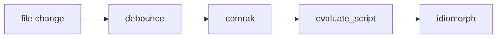

# Kitchen sink

A fixture that exercises every GFM feature the renderer claims to support. Edit it while `mhr` is open and watch the reload.

## Table of contents

Written as GitHub itself would resolve it, against the bare slug. `mhr` prefixes heading ids with `user-content-`, and rewrites a local link like this one to match, the same way GitHub's own rendering does.

- [Text](#text)
- [Definition list](#definition-list)
- [Multiline block quote](#multiline-block-quote)
- [Alerts](#alerts)
- [Task list](#task-list)
- [Table](#table)
- [Code](#code)
- [Raw HTML is escaped, not executed](#raw-html-is-escaped-not-executed)
- [Math](#math)
- [Mermaid](#mermaid)
- [Scroll test](#scroll-test)

## Text

Regular, *italic*, **bold**, ~~struck through~~, `inline code`, and a [link](https://example.com). Autolink: https://example.com

Footnote reference here.[^1]

[^1]: And the footnote body.

Superscript: x^2^

## Definition list

Term

: The definition.

## Multiline block quote

>>>
A quote that spans paragraph breaks, which a plain `>` quote cannot do.

Second paragraph, still inside.
>>>

## Alerts

> [!NOTE]
> Useful information a user should know.

> [!TIP]
> Helpful advice.

> [!IMPORTANT]
> Key information needed to succeed.

> [!WARNING]
> Urgent info needing immediate attention.

> [!CAUTION]
> Risks or negative outcomes.

## Task list

- [x] Watch the parent directory, not the file
- [x] Debounce at 150ms
- [ ] Preserve scroll across re-render
- [x] Vendor mermaid

## Table

| Layer | Crate | Notes |
| --- | --- | --- |
| Shell | wry + tao | system webview |
| Parse | comrak | port of cmark-gfm |
| Highlight | syntect | pure-Rust regex backend |
| Watch | notify | directory-scoped |

## Code

```rust
fn is_target(candidate: &Path, target: &Path) -> bool {
    if candidate == target {
        return true;
    }
    match (candidate.file_name(), target.file_name()) {
        (Some(a), Some(b)) => a == b && candidate.parent() == target.parent(),
        _ => false,
    }
}
```

```bash
mhr fixtures/kitchen-sink.md
```

## Raw HTML is escaped, not executed

<script>alert('this must not run')</script>

<details><summary>This should show as text, not a disclosure widget</summary>body</details>

## Math

Inline: $E = mc^2$

Display:

$$\int_0^\infty e^{-x^2}\,dx = \frac{\sqrt{\pi}}{2}$$

An `align` environment, which is numbered by `latex.css` and needs a positioned ancestor to be numbered against the equation rather than against the page:

$$\begin{align}
a &= b + c \\
x &= y + z
\end{align}$$

Code-span form: $`\sum_{i=1}^{n} i = \frac{n(n+1)}{2}`$

LaTeX that does not parse falls back to its own source: $\notarealcommand$

## Mermaid



## Scroll test

Everything below exists so there is something to scroll past when checking that scroll position survives a reload.

1. one
2. two
3. three

Lorem ipsum paragraph one.

Lorem ipsum paragraph two.

Lorem ipsum paragraph three.

Lorem ipsum paragraph four.

Lorem ipsum paragraph five.

Lorem ipsum paragraph six.

Lorem ipsum paragraph seven.

Lorem ipsum paragraph eight.

---

End of fixture. Edited.
